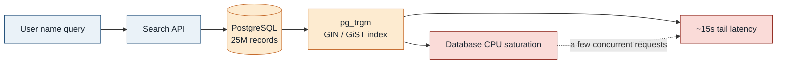
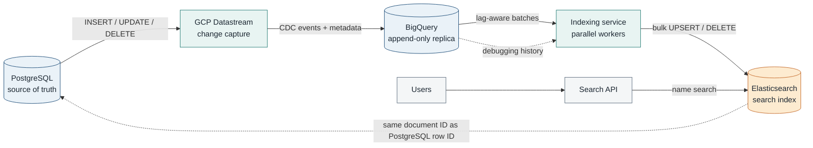
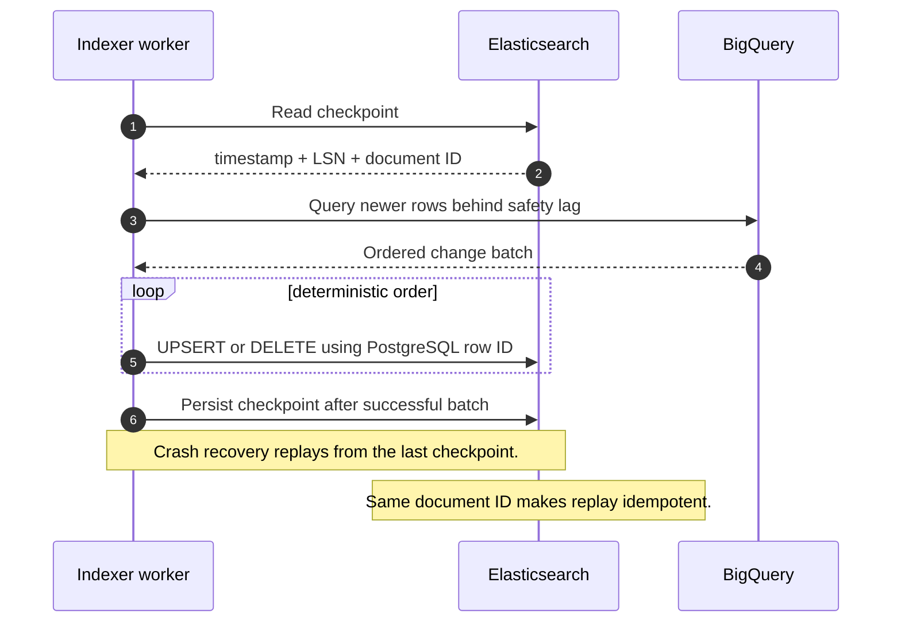
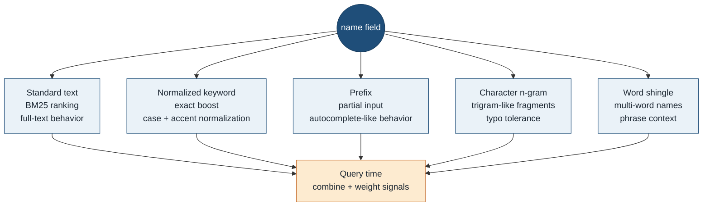
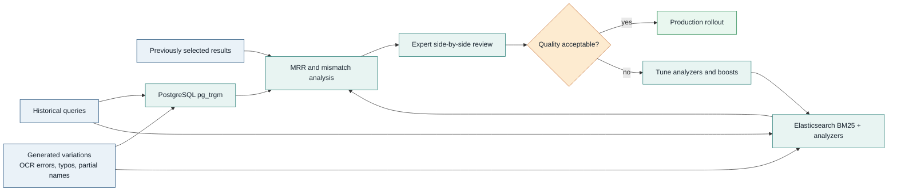

# Mermaid Diagram Gallery

These diagrams are derived from the Medium article:
<https://medium.com/@amir.rassafi/running-search-from-postgresql-pg-trgm-to-elasticsearch-bm25-5e78f23a0a7b>

## 1. PostgreSQL Search Bottleneck



## 2. Target Architecture



## 3. Deterministic Indexer Sharding

```mermaid
flowchart TB
  bq[(BigQuery change rows)]
  router{Shard key<br/>hash(row_id)}

  w1[Worker 1<br/>shards 0-3]
  w2[Worker 2<br/>shards 4-7]
  w3[Worker 3<br/>shards 8-11]
  w4[Worker 4<br/>shards 12-15]

  es[(Elasticsearch)]

  bq --> router
  router --> w1
  router --> w2
  router --> w3
  router --> w4

  w1 -->|bulk writes| es
  w2 -->|bulk writes| es
  w3 -->|bulk writes| es
  w4 -->|bulk writes| es

  note[Deterministic routing keeps each record on a predictable path.]
  router -.-> note

  classDef data fill:#EAF2F8,stroke:#1F4E79,color:#1B2631
  classDef worker fill:#E8F4F2,stroke:#2A7F78,color:#1B2631
  classDef search fill:#FDEBD0,stroke:#C56B2C,color:#1B2631
  classDef note fill:#F4F6F7,stroke:#5D6D7E,color:#1B2631

  class bq data
  class w1,w2,w3,w4,router worker
  class es search
  class note note
```

## 4. Checkpoint And Replay Flow



## 5. Name Index Design



## 6. Benchmark And Rollout


